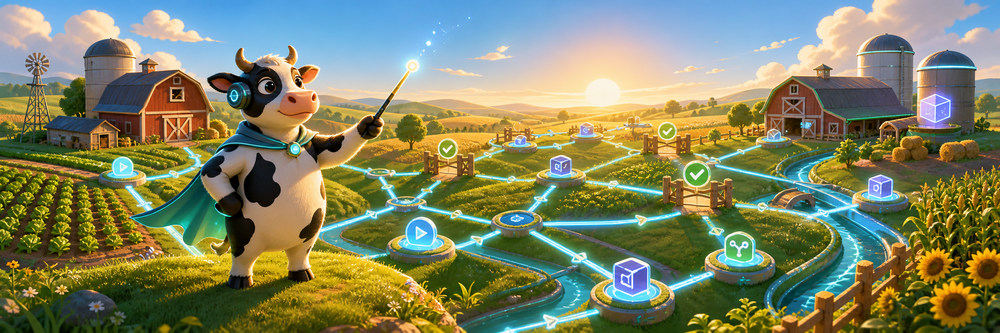

# cli-agentic-workflow(caw)



> A lightweight, local-first CLI that orchestrates AI agent CLIs like `claude -p` and `codex exec` into powerful, inspectable workflows — define a DAG in simple YAML, then validate, run, resume, and report with zero infrastructure.

[](https://github.com/aigengame/cli-agentic-workflow/issues/1)
[](https://www.python.org/)
[](https://github.com/astral-sh/uv)
[](LICENSE)


`caw` is not another chat UI and not an agent model provider. It is a local workflow kernel
that turns agent invocations into structured, repeatable workflow runs: every graph is
visible before execution, every node output is persisted, and every run can be resumed and
audited.

## Project status

**Pre-release — v0.1 specification complete, implementation in progress.**

The product scope, architecture, and vocabulary are fully specified and frozen in
[PRD #1](https://github.com/aigengame/cli-agentic-workflow/issues/1), with implementation
broken into tracer-bullet issues ([#2–#17](https://github.com/aigengame/cli-agentic-workflow/issues)).
[Installation](#installation) and [Quickstart](#quickstart) cover what runs **today**; the
[Example](#example), [CLI at a glance](#cli-at-a-glance), and [Built-in patterns](#built-in-patterns)
sections describe the full specified v0.1 surface, which becomes runnable as those issues land.

## Installation

caw needs **Python ≥ 3.12** and [uv](https://docs.astral.sh/uv/). It is not on PyPI yet
(planned — [#34](https://github.com/aigengame/cli-agentic-workflow/issues/34)), so install it
from the repository.

Install the CLI globally with uv:

```bash
uv tool install git+https://github.com/aigengame/cli-agentic-workflow
caw --help
```

Or work from a clone (recommended if you want to develop or read the source):

```bash
git clone https://github.com/aigengame/cli-agentic-workflow.git
cd cli-agentic-workflow
uv sync
uv run caw --help
```

Both give you the `caw` CLI — globally as `caw`, or as `uv run caw` inside a clone. The
examples below use `caw`; prefix them with `uv run` when working from a clone.

## Quickstart

A workflow is a YAML file of nodes and the `needs` edges between them. This one runs two
shell nodes in order — no agent CLI, no tokens, nothing to configure. Save it as
`hello.yaml`:

```yaml
name: hello-caw
version: 1
nodes:
  - id: greet
    kind: shell
    inputs:
      command: echo "hello from caw"
  - id: announce
    kind: shell
    needs: [greet]
    inputs:
      command: echo "ran after greet"
```

Validate it, inspect the plan, then run it:

```bash
caw validate hello.yaml   # workflow hello.yaml is valid (2 nodes)
caw graph hello.yaml      # the planned DAG, printed before anything runs
caw run hello.yaml        # node greet attempt 1 exited 0 ... run <run-id> succeeded
```

Every run is persisted under `.caw/runs/<run-id>/`: `state.sqlite` (node status, outputs,
resume eligibility), `events.jsonl` (the append-only trace), and `workflow.normalized.json`
(the exact graph that ran). Continue an interrupted or failed run — re-running only its
incomplete nodes — with `caw resume <run-id>`.

**Run an agent step offline.** Switch a node to `kind: agent` with the built-in `mock`
adapter to exercise the agent path with no real CLI and no tokens: it replays a fixture file
as the node's result (the same seam the test suite uses). Add to `nodes:`:

```yaml
  - id: summarize
    kind: agent
    needs: [greet]
    inputs:
      adapter: mock
      prompt: "summarize the greeting"
      fixture: summary.fixture.json
```

with `summary.fixture.json` next to the workflow file:

```json
{ "exit_status": 0, "stdout": "a one-line summary" }
```

`caw run hello.yaml` now runs the shell and agent nodes together. Swapping `adapter: mock`
for a real adapter (e.g. `claude.print`) is the only change needed to drive a real agent CLI.

## Why caw

- **Validate before you spend tokens.** `caw validate` catches schema errors, broken
  references, and dependency cycles before any agent CLI is invoked.
- **See the graph before it runs.** `caw graph` renders the execution plan; the normalized
  workflow snapshot is immutable once a run starts.
- **Vendor-neutral by design.** `claude -p` and `codex exec` are adapters with symmetric
  capabilities — switch an agent node between them by changing one `uses` value.
- **Resume instead of re-run.** Run state, events, and artifacts persist locally
  (SQLite + JSONL); interrupted runs continue without repeating completed nodes.
- **Human gates for high-impact steps.** A `human_gate` node parks the run durably until
  you approve — interactively or via `caw resume --approve`.
- **Reusable agentic patterns.** Pipeline, parallel, classify-and-act, generate-and-filter,
  fan-out synthesis, adversarial verification, tournament, and loop-until-done ship as
  built-ins that scaffold complete, runnable examples.
- **Reports you can hand to a reviewer.** Markdown, JSON, JSONL, or plain-text reports
  separate final conclusions from trace evidence.
- **Local-first, zero infrastructure.** One machine, one process, inspectable files on
  disk. No server, no control plane, no external workflow engine.

## How it works

A workflow is a YAML file describing nodes (agent calls, shell commands, Python functions,
classifiers, verifiers, synthesizers, reports, human gates) and the edges between them.
caw normalizes it into an acyclic, immutable intermediate representation, schedules ready
nodes concurrently on an asyncio event loop, and persists everything under `.caw/runs/<run-id>/`:

```text
.caw/runs/<run-id>/
  state.sqlite                # node status, attempts, outputs, resume eligibility
  events.jsonl                # append-only machine-readable trace
  workflow.normalized.json    # the exact graph that ran, with checksum
  artifacts/<node-id>/        # stdout, stderr, structured outputs
```

Iterative behavior (loops, regeneration, tournament rounds) never mutates a running graph:
a pattern controller evaluates a finished run and materializes the next immutable run,
linking them into a run group that reports and resumes as a unit.

Conditional behavior lives in node-level `when` predicates; structured outputs are
validated against JSON Schema (draft 2020-12) output contracts; env vars reach a node only
when explicitly declared and are never persisted.

## Example

```yaml
name: review-and-fix
version: 1

inputs:
  task:
    type: file

nodes:
  - id: diagnose
    kind: agent
    uses: codex.exec
    inputs:
      prompt: "Diagnose the failure described in ${inputs.task}"
    output_schema: schemas/diagnosis.json

  - id: verify
    kind: agent
    uses: claude.print
    needs: [diagnose]
    inputs:
      prompt: "Review the diagnosis and identify gaps."

  - id: report
    kind: report
    needs: [diagnose, verify]
    inputs:
      format: markdown
```

```bash
caw validate review-and-fix.yaml   # fail fast, before tokens
caw graph review-and-fix.yaml      # inspect the plan
caw run review-and-fix.yaml --input task.md
caw report <run-id> --format markdown
```

> ℹ️ This example uses the full specified surface (`uses:`, top-level `inputs:`,
> `caw run --input`, a `report` node) — not all of it runs yet. For a workflow that runs
> **today**, see [Quickstart](#quickstart).

## CLI at a glance

| Command | Purpose | Status |
| --- | --- | --- |
| `caw validate <file>` | Check schema, references, adapters, and acyclicity without executing | ✅ now |
| `caw graph <file>` | Render the planned DAG as text or JSON | ✅ now |
| `caw run <file>` | Execute a workflow run | ✅ now |
| `caw resume <run-id>` | Continue an interrupted or failed run, re-running only incomplete nodes | ✅ now |
| `caw init` | Create a minimal starter workflow | 🚧 planned |
| `caw report <run-id>` | Render a report (markdown, json, jsonl, text) from persisted state | 🚧 planned |
| `caw patterns list` | List built-in workflow patterns | 🚧 planned |
| `caw patterns init <name>` | Scaffold a complete runnable example of a pattern | 🚧 planned |

## Built-in patterns

| Pattern | Shape |
| --- | --- |
| Pipeline | Linear node chain |
| Parallel | Independent branches joined downstream |
| Classify and act | Classifier routes to one of several `when`-gated branches |
| Generate and filter | N candidate generators, then a scoring/validation filter |
| Fan-out synthesis | Parallel agents, then a synthesis node (the reference sample runs `claude.print` and `codex.exec` side by side) |
| Adversarial verification | Generator + verifiers, with accept / reject / regenerate |
| Tournament | Rounds or brackets with winner promotion and comparison evidence |
| Loop until done | Iterates immutable runs in a run group until a stop condition |

## Positioning

- **vs. Claude Code dynamic workflows** — caw is not natively integrated and has no
  background agent fleet, but it is vendor-neutral, config-as-code, source-controlled, and
  portable across agent CLIs.
- **vs. Airflow / Dagster / Prefect / Temporal** — caw has none of their distributed
  durability, and deliberately so: it is far lighter, models agent-specific concerns
  (prompts, output contracts, approval gates, token usage), and needs no service.
- **vs. ad hoc shell scripts** — more structure to learn, in exchange for validation,
  resume, state, reports, and reusable patterns.

## Documentation

- Product spec: [`docs/prd/0001-cli-agentic-workflow.md`](docs/prd/0001-cli-agentic-workflow.md)
- Architecture decisions: [`docs/adr/`](docs/adr/) — local-first kernel (0001), run-group
  iteration (0002), asyncio executor (0003), Python stack (0004), release model (0005),
  Adapter interface (0006)
- Domain vocabulary: [`CONTEXT.md`](CONTEXT.md)
- CI and release flow: [`docs/release-flow.md`](docs/release-flow.md)

## Development

Python >= 3.12, managed with [uv](https://docs.astral.sh/uv/):

```bash
uv sync                      # install
uv run pytest                # full suite (includes the local-only e2e tier)
uv run pytest -m "not e2e"   # non-e2e tier only (exactly what CI runs)
uv run ruff check && uv run ruff format --check
uv run mypy
```

Tests exercise external behavior only — what a user observes through the CLI, the on-disk
run directory, or a real agent-CLI run — never internal objects or call sequences. Coverage
spans seams that are **co-weighted**: the CLI itself, the on-disk run directory, a
fixture-replaying mock adapter (for behaviors a fixture can verify completely offline, no
tokens), and a real agent-CLI **e2e** tier (for behaviors whose correctness depends on the
real CLI). The mock complements the e2e tier; it does not replace it.

### Two-tier test suite: non-e2e and e2e

The **non-e2e** tier runs everywhere with no real Agent CLI. The **e2e** tier
(`tests/e2e/`, marked `e2e`) drives a real Agent CLI end to end — a real `claude -p` run
flowing through `caw run` into the Output Contract and State. Because most real usage runs
agent CLIs as nodes, e2e is mandatory coverage that grows as features land (new adapters,
multi-node graphs, patterns) — not an afterthought.

- **Local only, for now.** Cloud agent auth is not provisionable in GitHub Actions yet,
  so CI runs `pytest -m "not e2e"` and the e2e tier is a local gate. It migrates into CI
  once cloud auth is arranged ([#86](https://github.com/aigengame/cli-agentic-workflow/issues/86)).
- **One selected agent.** `CAW_E2E_AGENT` chooses the agent (default `claude`; `codex`
  lands with #11). Run the tier with `CAW_E2E_AGENT=claude uv run pytest -m e2e` against
  an authenticated CLI.
- **Fail, never skip.** When the selected agent's CLI is unavailable the e2e tests
  **FAIL** — they never skip — so a missing or unauthenticated CLI is never silent green.
- **Robust assertions.** e2e checks are contract/structure-based (exit status, Output
  Contract validation, persisted State shape), never exact model text, and a transient
  network/5xx/rate-limit failure gets a bounded retry while assertion failures never do.

## Contributing

Work is tracked as GitHub issues with a triage-label workflow; issues labeled
`ready-for-agent` are fully specified and independently grabbable. Start from
[PRD #1](https://github.com/aigengame/cli-agentic-workflow/issues/1) for the big picture.
Commits follow [Conventional Commits](https://www.conventionalcommits.org/).

## License

[MIT](LICENSE)
